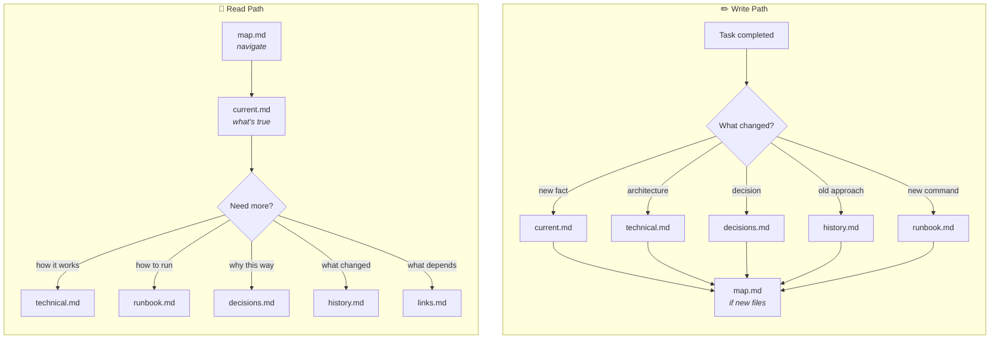
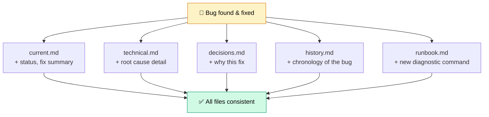
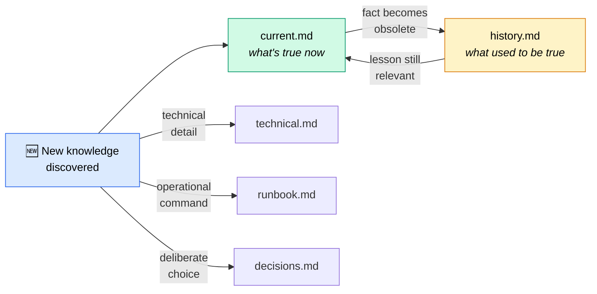

<div align="center">

# 🧠 Knowledge Protocol

**A structured knowledge base protocol for AI agents.**  
Define once, use everywhere.

[](LICENSE)
[](CHANGELOG.md)

</div>

---

AI agents working on real projects accumulate knowledge — architectural decisions, API contracts, debugging lessons, operational runbooks. Without a protocol, this knowledge either:

- 💬 **Lives in chat history** — lost between sessions
- 📄 **Gets dumped into a single file** — grows into an unreadable wall of text
- 📂 **Scatters across ad-hoc notes** — nobody can find anything twice

Knowledge Protocol gives agents a consistent, navigable structure that stays useful as projects grow. No framework lock-in. No runtime dependencies. Pure markdown.

---

## The 6-file structure

Every project gets a folder with exactly **6 files** — each with a single job:

```
kb/
├── map.md              ← 📍 START HERE — navigation index
├── README.md
└── your-project/
    ├── current.md      ← What's true right now
    ├── technical.md    ← How it works
    ├── runbook.md      ← How to run it
    ├── decisions.md    ← Why it's this way
    ├── history.md      ← What used to be true
    └── links.md        ← What depends on what
```

| File | One-line purpose | When to read |
|------|-----------------|-------------|
| `current.md` | What's true right now | Quick recall of key facts |
| `technical.md` | How it works — architecture, API, models | Understanding internals |
| `runbook.md` | How to run it — commands, env vars, ports | Starting or developing |
| `decisions.md` | Why it's this way — tradeoffs, alternatives | Understanding rationale |
| `history.md` | What used to be true — old approaches, dead ends | Avoiding repeated mistakes |
| `links.md` | What depends on what — cross-project connections | Understanding impact |

---

## How it works



Read left → right. The **read path** starts at `map.md` and drills down progressively. The **write path** fans out — one event touches multiple files, then converges back to `map.md`.

---

## The update matrix

This is the core insight: **one event → multiple files**. A bug fix isn't just a `current.md` entry.



| What happened | current | technical | decisions | history | runbook |
|---|---|---|---|---|---|
| Bug found & fixed | + status, fix | + root cause | + why this fix | + chronology | + diagnostic cmd |
| Architecture changed | + new structure | + updated diagram | + why change | + old architecture | — |
| New module added | + module exists | + API | — | — | + how to run |
| Decision reversed | + new direction | + implications | + new + old rationale | + old decision | — |
| Operational incident | + status note | — | — | + incident report | + new procedure |

Updating only `current.md` is the #1 mistake. A future session reading `technical.md` still sees the old facts. The KB becomes self-contradictory.

---

## The lifecycle of knowledge



Knowledge flows from discovery → `current.md` → `history.md` as it becomes obsolete. But lessons from history can loop back — a past incident that resurfaces gets re-promoted to `current.md`.

**Key rule:** before overwriting `current.md`, move the old fact to `history.md`. Never delete without archiving.

---

## The five principles

### 1. Current ≠ Historical

`current.md` contains only what's true **right now**. When facts change, the old version moves to `history.md` before the new one is written. This eliminates the "is this still true?" problem.

### 2. One update touches all relevant files

A bug fix is 4–5 file updates, not 1. See the update matrix above. Partial updates create inconsistency — the worst state for a knowledge base.

### 3. Stale knowledge is worse than missing knowledge

An outdated `current.md` actively misleads. A missing `current.md` is honestly empty. When you spot drift between code and docs, fix the docs immediately.

### 4. Map is the entry point

Every file must be reachable from `map.md`. An orphan file is a lost file — no session will find it.

### 5. Knowledge ≠ chronicle

`implementation_notes.md` (chronological work log) lives in the repo root, not in the KB. KB = what's known and why. Notes = what was done and when.

---

## Quick start

### Initialize a knowledge base in your project

```bash
bash scripts/init-kb.sh /path/to/your/project --name "My Project"
```

This creates:

```
your-project/
└── kb/
    ├── map.md                  ← navigation index
    ├── README.md               ← how this KB is organized
    └── my-project/
        ├── current.md          ← fill in current facts
        ├── technical.md        ← fill in architecture
        ├── runbook.md          ← fill in startup commands
        ├── decisions.md        ← fill in as decisions are made
        ├── history.md          ← grows over time
        └── links.md            ← fill in dependencies
```

### Install skills for Hermes Agent

```bash
git clone https://github.com/shavkunov/knowledge-protocol /tmp/kp-clone
cp -R /tmp/kp-clone/skills/kb-read ~/.hermes/skills/
cp -R /tmp/kp-clone/skills/kb-write ~/.hermes/skills/
rm -rf /tmp/kp-clone
```

### Install for Claude Code

```bash
mkdir -p ~/.claude/skills
git clone https://github.com/shavkunov/knowledge-protocol /tmp/kp-clone
cp -R /tmp/kp-clone/skills/kb-read ~/.claude/skills/
cp -R /tmp/kp-clone/skills/kb-write ~/.claude/skills/
rm -rf /tmp/kp-clone
```

### Install for Codex CLI

```bash
mkdir -p ~/.codex/skills
git clone https://github.com/shavkunov/knowledge-protocol /tmp/kp-clone
cp -R /tmp/kp-clone/skills/kb-read ~/.codex/skills/
cp -R /tmp/kp-clone/skills/kb-write ~/.codex/skills/
rm -rf /tmp/kp-clone
```

---

## What's in the box

```
knowledge-protocol/
├── skills/
│   ├── kb-read/                  Read skill
│   │   ├── SKILL.md              Skill definition
│   │   └── references/
│   │       └── read-workflow.md    Navigation strategies & fallbacks
│   └── kb-write/                 Write skill
│       ├── SKILL.md              Skill definition
│       ├── references/
│       │   ├── update-rules.md     When & how to update each file
│       │   └── pitfalls.md         9 common KB maintenance mistakes
│       └── templates/            Starter templates
│           ├── map.md
│           ├── current.md
│           ├── technical.md
│           ├── runbook.md
│           ├── decisions.md
│           ├── history.md
│           └── links.md
├── scripts/
│   └── init-kb.sh                Scaffold a KB in any project
├── tests/
│   └── init-kb.test.sh           Verify init-kb.sh output (7 assertions)
├── AGENTS.md                     Authoritative project doc for AI agents
├── CHANGELOG.md                  Per-version release notes
└── LICENSE                       MIT
```

---

## Common mistakes

| # | Mistake | Why it hurts | Fix |
|---|---------|-------------|-----|
| 1 | Updating only `current.md` | Other files become stale, KB self-contradicts | Update all affected files |
| 2 | Overwriting without archiving | No record of when/why things changed | Move old → `history.md` first |
| 3 | Letting the KB go stale | Outdated KB is worse than no KB | Fix drift on sight |
| 4 | Creating orphan files | Invisible to navigation, never found again | Always update `map.md` |
| 5 | Duplicating instead of referencing | Same fact in 3 files = 3 updates when it changes | One canonical home per fact |
| 6 | Mixing work logs with knowledge | `current.md` becomes a timeline, not a reference | Work logs → `implementation_notes.md` |
| 7 | Writing essays instead of bullets | `current.md` becomes unscannable | 1–2 lines per bullet, detail → other files |
| 8 | Skipping KB update after review | Next session starts with stale context | Update `technical.md` + `current.md` |
| 9 | Treating `history.md` as trash | Unstructured dump nobody can search | Self-contained entries with date + lesson |

Full details in [`skills/kb-write/references/pitfalls.md`](skills/kb-write/references/pitfalls.md).

---

## License

[MIT](LICENSE) — use it, fork it, adapt it.
