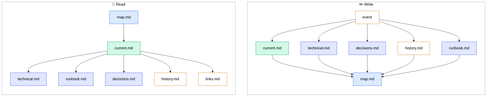
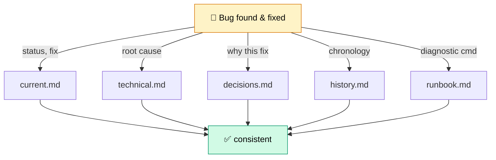
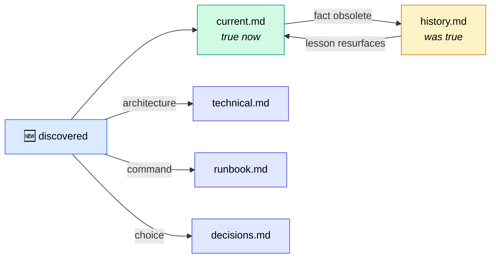

<div align="center">

# 🧠 Second Brain

**Structured memory for AI agents.**  
Knowledge that survives sessions.

[](LICENSE)
[](CHANGELOG.md)

</div>

---

AI agents accumulate knowledge — decisions, APIs, runbooks, debugging lessons.  
Without structure it ends up in chat history, one giant file, or scattered notes.  

**Second Brain** gives agents a 6-file markdown layout with **zero runtime dependencies**.

---

## How it works



**Read:** start at `map.md`, drill into `current.md`, branch out only as needed.  
**Write:** one event fans out across multiple files, then converges back to `map.md`.

---

## The 6 files

Every project gets a folder with exactly 6 files — each with one job:

```
kb/
├── map.md              ← 📍 START HERE
├── README.md
└── your-project/
    ├── current.md      ← what's true now
    ├── technical.md    ← how it works
    ├── runbook.md      ← how to run it
    ├── decisions.md    ← why it's this way
    ├── history.md      ← what used to be true
    └── links.md        ← what depends on what
```

| File | One job | When to open |
|------|---------|-------------|
| `map.md` | Navigate | **Every session** — find the project section |
| `current.md` | What's true now | **Every session** — scan before you start |
| `technical.md` | How it works | Before changing internals |
| `runbook.md` | How to run it | Before running or deploying |
| `decisions.md` | Why it's this way | When you need the "why" |
| `history.md` | What used to be true | When debugging repeats or tracing change |
| `links.md` | What depends on what | When a change may affect other repos |

---

## The update matrix

One event → multiple files. A bug fix is **not** just a `current.md` entry.



| What happened | current | technical | decisions | history | runbook |
|---|:---:|:---:|:---:|:---:|:---:|
| Bug found & fixed | ✅ status, fix | ✅ root cause | ✅ why this fix | ✅ chronology | ✅ diagnostic cmd |
| Architecture changed | ✅ new structure | ✅ updated diagram | ✅ why change | ✅ old architecture | — |
| New module added | ✅ module exists | ✅ API | — | — | ✅ how to run |
| Decision reversed | ✅ new direction | ✅ implications | ✅ new + old rationale | ✅ old decision | — |
| Operational incident | ✅ status note | — | — | ✅ incident report | ✅ new procedure |

Updating only `current.md` is the **#1 mistake** — other files go stale and the KB contradicts itself.

---

## Knowledge lifecycle



Before overwriting `current.md`, move the old fact to `history.md`. Never delete without archiving.

---

## The five principles

| # | Principle | Why |
|---|-----------|-----|
| 1 | **Current ≠ historical** | `current.md` is only what's true right now. Obsolete → `history.md` first. |
| 2 | **One update → all relevant files** | See the matrix. Partial updates create inconsistency. |
| 3 | **Stale > missing is false** | An outdated `current.md` actively misleads. Fix drift on sight. |
| 4 | **Map is the entry point** | Every file reachable from `map.md`. Orphans are invisible. |
| 5 | **Knowledge ≠ chronicle** | Work logs → `implementation_notes.md` at repo root. KB = what's known. |

---

## Quick start

**Scaffold a KB in your project:**

```bash
bash scripts/init-kb.sh /path/to/your/project --name "My Project"
```

**Install agent skills** (from a clone of this repo):

```bash
bash scripts/install-skills.sh hermes   # → ~/.hermes/skills/
bash scripts/install-skills.sh claude   # → ~/.claude/skills/
bash scripts/install-skills.sh codex    # → ~/.codex/skills/
```

Works with Hermes Agent, Claude Code, Codex CLI, or any agent that reads markdown skills.

---

## Learn more

| Doc | What's inside |
|-----|---------------|
| [docs/protocol.md](docs/protocol.md) | Update matrix, lifecycle, principles (extended) |
| [AGENTS.md](AGENTS.md) | Repo layout and conventions for contributors |
| [skills/kb-read/SKILL.md](skills/kb-read/SKILL.md) | Read workflow for agents |
| [skills/kb-write/SKILL.md](skills/kb-write/SKILL.md) | Write workflow for agents |
| [skills/kb-write/references/pitfalls.md](skills/kb-write/references/pitfalls.md) | Nine common KB mistakes |

---

## License

[MIT](LICENSE)
