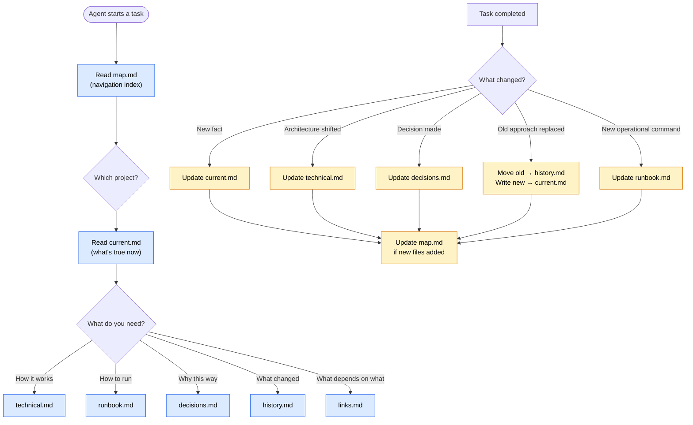

# Knowledge Protocol

A structured knowledge base protocol for AI agents. Define once, use everywhere.

## The problem

AI agents working on real projects accumulate knowledge — architectural decisions, API contracts, debugging lessons, operational runbooks. Without a protocol, this knowledge either:

- **Lives in chat history** — lost between sessions
- **Gets dumped into a single file** — grows into an unreadable wall of text
- **Scatters across ad-hoc notes** — nobody can find anything twice

Knowledge Protocol gives agents a consistent, navigable structure that stays useful as projects grow.

## How it works



Blue = read path. Yellow = write path. Every piece of knowledge lands in the right file, and every file is reachable from `map.md`.

## The 6-file structure

Each project (or component) gets a folder with exactly 6 files:

| File | Purpose | When to read |
|------|---------|-------------|
| `current.md` | What's true right now — short, actionable | Quick recall of key facts |
| `technical.md` | How it works — architecture, API, models | Understanding internals |
| `runbook.md` | How to run it — commands, env vars, ports | Starting or developing |
| `decisions.md` | Why it's this way — tradeoffs, alternatives | Understanding rationale |
| `history.md` | What used to be true — old approaches, dead ends | Avoiding repeated mistakes |
| `links.md` | What depends on what — cross-project connections | Understanding impact |

A `map.md` at the root ties everything together with a navigation index.

## The core principle

**Integrate, don't dump.**

Every note must be reachable through `map.md`. Every update must touch all relevant files (not just one). Stale knowledge is worse than missing knowledge — it actively misleads.

## Install

### For any agent framework (manual)

```bash
# Clone the repo
git clone https://github.com/<you>/knowledge-protocol /tmp/kp-clone

# Initialize a knowledge base in your project
bash /tmp/kp-clone/scripts/init-kb.sh /path/to/your/project

# Or copy skills manually
cp -R /tmp/kp-clone/skills/kb-read ~/.hermes/skills/
cp -R /tmp/kp-clone/skills/kb-write ~/.hermes/skills/
```

### Initialize a knowledge base

```bash
# Creates the kb/ directory structure inside your project
bash scripts/init-kb.sh /path/to/project [--name "My Project"]
```

This creates:
```
your-project/
└── kb/
    ├── map.md
    ├── README.md
    └── _project_name/        # your project's section
        ├── current.md
        ├── technical.md
        runbook.md
        ├── decisions.md
        ├── history.md
        └── links.md
```

## Use with Hermes Agent

The two skills (`kb-read` and `kb-write`) are designed for [Hermes Agent](https://github.com/nousresearch/hermes-agent) but work with any agent that supports SKILL.md-format skills.

### kb-read

Loaded automatically when the agent needs context from the knowledge base. Defines the read workflow: `map.md` → project folder → specific file.

### kb-write

Loaded when the agent completes a task and needs to update the knowledge base. Enforces "integrate, don't dump" — updates must touch all relevant files, not just the obvious one.

## Repo layout

```
knowledge-protocol/
├── README.md                   This file
├── AGENTS.md                   Authoritative project doc for AI agents
├── CHANGELOG.md                Per-version release notes
├── LICENSE                     MIT
├── skills/
│   ├── kb-read/                Read skill for Hermes Agent
│   │   ├── SKILL.md            Skill definition
│   │   ├── references/         Deep-dive docs the agent reads on demand
│   │   │   └── read-workflow.md
│   │   └── templates/          (none — read skill doesn't write)
│   └── kb-write/               Write skill for Hermes Agent
│       ├── SKILL.md            Skill definition
│       ├── references/         Deep-dive docs
│       │   ├── update-rules.md   When and how to update each file
│       │   └── pitfalls.md       Common mistakes in KB maintenance
│       └── templates/          Starter templates
│           ├── map.md
│           ├── current.md
│           ├── technical.md
│           ├── runbook.md
│           ├── decisions.md
│           ├── history.md
│           └── links.md
├── scripts/
│   └── init-kb.sh             Scaffold a KB in any project
└── tests/
    └── init-kb.test.sh        Verify init-kb.sh output
```

## Philosophy

1. **Current ≠ historical.** `current.md` contains only what's true now. When facts change, the old version moves to `history.md` before the new one is written. This prevents the "is this still true?" problem.

2. **One update touches all relevant files.** A bug fix isn't just a `current.md` entry — it's also a `decisions.md` note (why this fix), a `history.md` entry (what was broken), and possibly a `runbook.md` addition (new operational command).

3. **Stale knowledge is worse than missing knowledge.** An outdated `current.md` actively misleads future sessions. When you spot drift between code and docs, update the docs immediately — don't schedule it.

4. **Map is the entry point.** Every file must be reachable from `map.md`. An orphan file is a lost file.

5. **Implementation notes are separate from knowledge.** `implementation_notes.md` (chronological work log) lives in the repo root, not in the KB. KB = what's known and why. Notes = what was done and when.

## License

MIT
