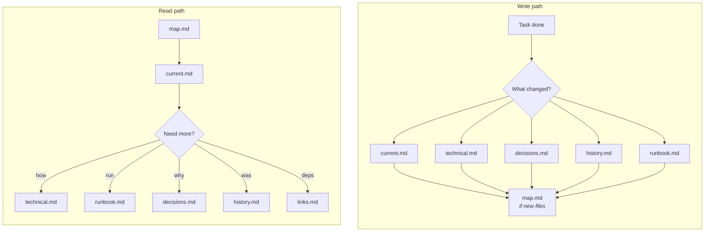

<div align="center">

# 🧠 Second Brain

**A second brain for AI agents.**  
Structured memory that survives sessions.

[](LICENSE)
[](CHANGELOG.md)

</div>

---

AI agents accumulate project knowledge — decisions, APIs, runbooks, debugging lessons. Without structure it ends up in chat history, one giant file, or scattered notes. Second Brain gives agents a **6-file markdown layout** with no runtime dependencies.

## Structure

```
kb/
├── map.md              ← START HERE
├── README.md
└── your-project/
    ├── current.md      ← what's true now
    ├── technical.md    ← how it works
    ├── runbook.md      ← how to run it
    ├── decisions.md    ← why it's this way
    ├── history.md      ← what used to be true
    └── links.md        ← cross-project dependencies
```

| File | Purpose |
|------|---------|
| `current.md` | Active facts — short, scannable |
| `technical.md` | Architecture, API, models |
| `runbook.md` | Commands, env vars, ports |
| `decisions.md` | Tradeoffs and rationale |
| `history.md` | Old approaches, dead ends |
| `links.md` | Dependencies between projects |

## How it works



Read: `map.md` → `current.md` → drill down as needed.  
Write: one event often updates **several files** — not only `current.md`. See [docs/protocol.md](docs/protocol.md) for the update matrix, lifecycle, and principles.

## Quick start

**Scaffold a KB in your project:**

```bash
bash scripts/init-kb.sh /path/to/your/project --name "My Project"
```

**Install agent skills** (from a clone of this repo, or any directory that contains `skills/`):

```bash
bash scripts/install-skills.sh hermes   # ~/.hermes/skills/
bash scripts/install-skills.sh claude   # ~/.claude/skills/
bash scripts/install-skills.sh codex    # ~/.codex/skills/
```

Works with Hermes Agent, Claude Code, Codex CLI, or any agent that loads markdown skills.

## Learn more

| Doc | What's inside |
|-----|---------------|
| [docs/protocol.md](docs/protocol.md) | Update matrix, lifecycle, principles |
| [AGENTS.md](AGENTS.md) | Repo layout and conventions for contributors |
| [skills/kb-read/SKILL.md](skills/kb-read/SKILL.md) | Read workflow for agents |
| [skills/kb-write/SKILL.md](skills/kb-write/SKILL.md) | Write workflow for agents |
| [skills/kb-write/references/pitfalls.md](skills/kb-write/references/pitfalls.md) | Nine common KB mistakes |

## License

[MIT](LICENSE)
